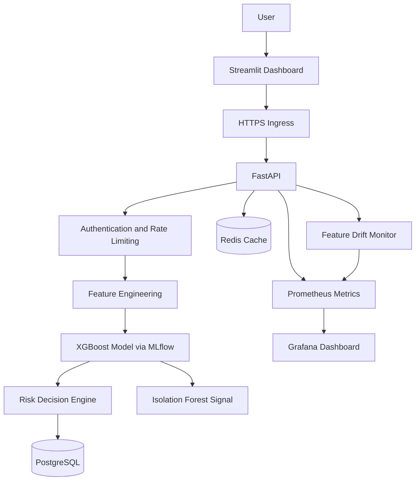

# Fraud Detection MLOps Platform

An end-to-end machine learning platform for detecting potentially fraudulent financial transactions, serving predictions through an authenticated API, and monitoring model and system behavior.

The project combines machine learning, backend engineering, model lifecycle management, containerization, Kubernetes orchestration, observability, and an interactive dashboard.

## Key Features

- **Fraud classification:** XGBoost-based transaction risk prediction.
- **Feature engineering:** Transaction amount, sender/receiver balances, and engineered behavioral features.
- **Anomaly detection:** Isolation Forest as a complementary anomaly signal.
- **Risk engine:** Maps fraud probabilities to `ALLOW`, `REVIEW`, or `BLOCK` decisions.
- **REST API:** FastAPI endpoints for health checks, predictions, transaction history, and Prometheus metrics.
- **Model lifecycle:** MLflow experiment tracking, model registry, and champion-model loading.
- **Persistence and caching:** PostgreSQL for stored predictions and Redis for caching and rate limiting.
- **Monitoring:** Prometheus metrics, Grafana dashboards, and feature-drift monitoring.
- **Automated retraining workflow:** Validation and champion-model comparison logic.
- **Containerization:** Docker image built to run as a non-root user.
- **Orchestration:** Kubernetes deployments, services, health probes, autoscaling, and Ingress.
- **Interactive UI:** Streamlit pages for overview, transaction analysis, transaction exploration, and model monitoring.
- **Testing and CI:** Pytest suite and GitHub Actions workflow.

## Architecture



## Technology Stack

| Area | Technologies |
|---|---|
| Language | Python |
| Machine learning | XGBoost, scikit-learn, NumPy, pandas |
| Model management | MLflow |
| API | FastAPI, Uvicorn |
| Database | PostgreSQL |
| Cache and rate limiting | Redis |
| Dashboard | Streamlit, Plotly |
| Monitoring | Prometheus, Grafana |
| Infrastructure | Docker, Docker Compose, Kubernetes |
| TLS and ingress | NGINX Ingress, cert-manager |
| Testing and CI | Pytest, GitHub Actions |

## Machine Learning

The project uses the PaySim synthetic mobile-money transaction dataset.

The dataset contains approximately 6.36 million transactions and has a highly imbalanced fraud class. This makes precision-recall evaluation and decision-threshold selection important.

The pipeline includes:

1. Exploratory data analysis.
2. Transaction feature engineering.
3. Preprocessing and time-based data splitting.
4. XGBoost model training and evaluation.
5. Risk-threshold configuration.
6. Anomaly scoring as a complementary signal.
7. MLflow model tracking and registration.

### Risk Decisions

| Decision | Probability range |
|---|---|
| `ALLOW` | Probability below 0.01 |
| `REVIEW` | Probability from 0.01 to below 0.99 |
| `BLOCK` | Probability of 0.99 or higher |

These thresholds are configurable policy choices, not universal fraud standards. The final decision is produced by the backend risk engine.

### Evaluation Notes

Evaluate the model using precision, recall, F1-score, and PR-AUC. Because the dataset is synthetic, strong test-set performance should not be interpreted as proof of equivalent real-world fraud detection performance.

If publishing metrics, include the evaluation split, threshold, and experiment details so that results can be reproduced.

## Project Structure

```text
fraud-detection-mlops/
├── .github/
│   └── workflows/              # CI workflow
├── api/
│   └── main.py                 # FastAPI application
├── configs/
│   └── retraining.yml          # Retraining configuration
├── k8s/                        # Kubernetes manifests
│   └── prometheus/              # Prometheus configuration and alerts
├── models/                     # Local model artifacts; not committed
├── notebooks/                  # Exploratory analysis
├── src/
│   ├── anomaly.py
│   ├── auth.py
│   ├── cache.py
│   ├── database.py
│   ├── drift.py
│   ├── drift_monitor.py
│   ├── features.py
│   ├── metrics.py
│   ├── mlflow_model.py
│   ├── predict.py
│   ├── preprocessing.py
│   ├── rate_limiter.py
│   ├── retrain.py
│   ├── risk_engine.py
│   └── train.py
├── streamlit/
│   ├── app.py
│   ├── api_client.py
│   └── pages/
├── tests/                      # Automated tests
├── Dockerfile
├── docker-compose.yml
├── requirements.txt
└── README.md
```

## Prerequisites

- Python 3.11
- Git
- Docker Desktop with Kubernetes enabled, if using the local Kubernetes setup
- A configured PostgreSQL and Redis instance, or the supplied Docker Compose stack
- A trained/registered model and required local artifacts for prediction

## Local Setup

### 1. Clone the repository

```bash
git clone https://github.com/shekh201/fraud-detection-mlops.git
cd fraud-detection-mlops
```

### 2. Create and activate a virtual environment

Windows PowerShell:

```powershell
python -m venv .venv
.\.venv\Scripts\Activate.ps1
```

### 3. Install dependencies

```powershell
python -m pip install --upgrade pip
pip install -r requirements.txt
```

### 4. Configure environment variables

Create a local `.env` file based on the environment variables required by the API and deployment configuration.

Configure the database connection, Redis connection, API authentication key, and MLflow/model settings as required by your local setup.

**Never commit `.env` files, passwords, API keys, or production credentials.** The exact environment variable names should match the application's configuration.

### 5. Start the services

The repository includes a Docker Compose configuration:

```bash
docker compose up -d --build
```

Check the service status:

```bash
docker compose ps
docker compose logs --tail=100
```

Review `docker-compose.yml` for the configured ports, environment variables, health checks, and service dependencies before starting the stack.

## API

The FastAPI application exposes the following endpoints:

| Endpoint | Purpose |
|---|---|
| `GET /health` | API and model health information |
| `POST /predict` | Predict fraud probability and risk decision |
| `GET /transactions` | Retrieve stored prediction records |
| `GET /metrics` | Expose Prometheus metrics |

Prediction and transaction endpoints may require the configured API key.

### Example Prediction Request

Replace the URL and API key with values for your environment.

```bash
curl -X POST "http://localhost:8000/predict" \
  -H "Content-Type: application/json" \
  -H "X-API-Key: YOUR_LOCAL_API_KEY" \
  -d '{
    "step": 1,
    "type": "TRANSFER",
    "amount": 10000,
    "oldbalanceOrg": 20000,
    "newbalanceOrig": 10000,
    "oldbalanceDest": 5000,
    "newbalanceDest": 15000
  }'
```

A successful response includes the fraud probability, risk decision, and anomaly score, subject to the current API implementation.

## Streamlit Dashboard

Launch the dashboard from the repository root:

```bash
streamlit run streamlit/app.py
```

The dashboard includes:

- **Executive Overview:** Prediction summaries and recent transactions.
- **Transaction Analyzer:** Submit transaction details and inspect the model's result.
- **Transaction Explorer:** Browse and filter stored predictions.
- **Model Monitoring:** View API health, operational metrics, and available feature-drift measurements.

Configure the dashboard's API URL and authentication key to match the API environment. Local self-signed TLS certificates may require a development-only configuration; certificate verification should remain enabled in production.

## Docker

Build the API image:

```bash
docker build -t fraud-detection-api:local .
```

Run the image only after configuring the required model artifacts, database, Redis, and environment variables. Refer to the Docker Compose and Kubernetes configuration for the expected runtime settings.

The Dockerfile creates a dedicated non-root application user.

## Kubernetes

The `k8s/` directory contains manifests for the application and its supporting infrastructure, including:

- Namespace and API deployment/service.
- PostgreSQL deployment, service, and persistent volume claim.
- Redis deployment and service.
- API configuration, ingress, TLS resources, and autoscaling.
- Prometheus deployment, scraping configuration, and alert rules.

Apply the manifests in the appropriate order for your environment. Confirm that secrets, image references, storage, DNS, and TLS settings are correct before deployment.

Example commands:

```bash
kubectl apply -f k8s/namespace.yaml
kubectl get pods -n fraud-detection
kubectl get services -n fraud-detection
kubectl get ingress -n fraud-detection
```

Some resources depend on installed cluster components such as the NGINX Ingress Controller, cert-manager, and Metrics Server. A local self-signed certificate and local TLS workarounds are for development only.

**Security:** The Secret manifests containing credentials are intentionally excluded from Git. Create the required Kubernetes Secrets separately before deploying dependent workloads.

## Monitoring and Drift

Prometheus collects API metrics, while Grafana provides dashboards for operational visibility. The drift monitor compares current transaction data against a reference dataset and reports feature Population Stability Index (PSI) values when sufficient data is available.

The current configuration requires at least 1,000 stored transactions before drift calculations can run. With fewer records, an `INSUFFICIENT_DATA` status is expected.

PSI thresholds are monitoring heuristics. Drift indicates a change in feature distributions and does not, by itself, prove that model accuracy has degraded.

API counters may be process-local. When multiple replicas are running, counters exposed by an individual API instance should not automatically be interpreted as complete cluster-wide totals.

## Retraining

The project includes a retraining workflow that evaluates a candidate model against configured validation thresholds and the registered champion model before promoting it.

Review `configs/retraining.yml` and `src/retrain.py` before running retraining. Training uses a large dataset and can consume substantial CPU, memory, and time. Do not run it casually against production model artifacts.

Retraining code being present does not mean scheduled retraining is enabled and operational in every deployment.

## Tests

Run the automated test suite from the repository root:

```bash
pytest -q
```

Tests cover key application components such as API behavior, authentication, caching, database operations, feature engineering, prediction, preprocessing, rate limiting, and risk decisions.

Record the latest test result from your own environment before publishing a claim about passing tests.

## Security Considerations

- Keep `.env` files, passwords, tokens, and API keys out of version control.
- Use Kubernetes Secrets or an external secrets manager for sensitive configuration.
- Do not treat base64-encoded Kubernetes Secret data as encrypted.
- Use trusted TLS certificates and keep certificate verification enabled in production.
- Restrict database and Redis network access.
- Configure production authentication keys, storage, and observability deliberately.
- Use least-privilege permissions and review container and Kubernetes security settings before production deployment.

## Limitations

- PaySim is a synthetic dataset; real-world generalization needs independent validation.
- Fraud probabilities and risk thresholds depend on the training data and configured policy.
- Drift monitoring requires sufficient stored transaction volume.
- Process-local metrics may not reflect aggregate activity across multiple API replicas.
- Local development TLS and Kubernetes settings must be hardened before production use.

## Future Improvements

- Evaluate against independently sourced, appropriately licensed real-world datasets.
- Add model performance monitoring when delayed ground-truth labels become available.
- Aggregate metrics reliably across API replicas.
- Add automated integration and deployment tests.
- Introduce managed secrets, trusted TLS, and production deployment policies.
- Document reproducible training and evaluation results.

## Author

**Shekh Rizwan**

GitHub: [@shekh201](https://github.com/shekh201)

---

*This project is intended for learning, portfolio demonstration, and engineering experimentation. It is not a certified financial fraud prevention system.*
